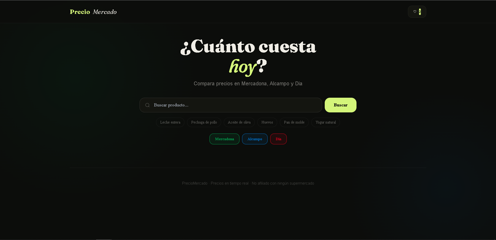
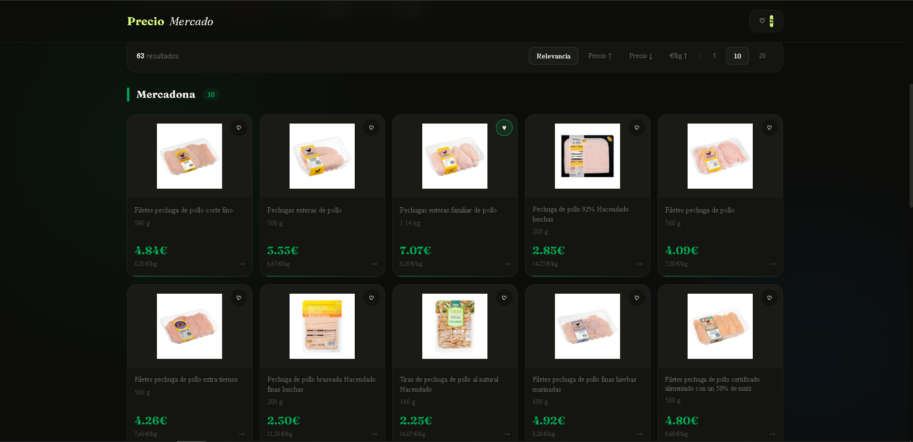
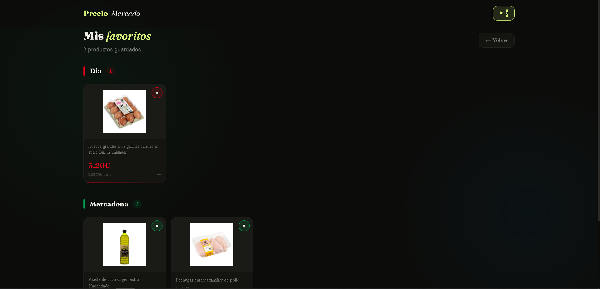

# PrecioMercado 🛒

Comparador de precios en tiempo real para **Mercadona**, **Alcampo** y **Dia**.


## Características

- Búsqueda simultánea en los 3 supermercados
- Precios, precio por kg/l e imágenes de productos
- Ordenar por relevancia, precio o precio/kg
- Favoritos por dispositivo (sin registro)
- Diseño responsive para móvil y escritorio

---

## Instalación

### Requisitos
- Python 3.10+
- Node.js 18+

### Backend

```bash
cd backend
python -m venv venv

# Windows
venv\Scripts\activate
# Mac/Linux
source venv/bin/activate

pip install -r requirements.txt
uvicorn main:app --reload --port 8000
```

### Frontend

```bash
cd frontend
npm install
npm run dev
```

Abre **http://localhost:5173**

---

## Configuración de Alcampo (opcional)

Sin configuración, Alcampo muestra productos pero **sin precio ni imagen**.
Para activarlos (~5 min, las credenciales duran semanas):

1. Abre Chrome y ve a [compraonline.alcampo.es](https://www.compraonline.alcampo.es)
2. **F12** → Network → Fetch/XHR
3. Navega a cualquier página de producto
4. Busca la petición **PUT** a `/api/webproductpagews/v6/products`
5. En **Headers → Request Headers** copia:
   - `cookie` → pega en `ALCAMPO_COOKIE`
   - `x-csrf-token` → pega en `ALCAMPO_CSRF`
6. Crea el archivo `backend/.env`:

```env
ALCAMPO_COOKIE=tu_cookie_aqui
ALCAMPO_CSRF=tu_csrf_aqui
```

7. Reinicia el backend

Cuando dejen de funcionar (error 403), repite el proceso.

---

## Estructura del proyecto

```
supermarket-prices/
├── backend/
│   ├── main.py              # API FastAPI
│   ├── database.py          # SQLite (productos + favoritos)
│   ├── requirements.txt
│   ├── .env                 # Credenciales Alcampo
│   └── scrapers/
│       ├── mercadona.py     # API Algolia
│       ├── alcampo.py       # JSON-LD + API autenticada
│       └── dia.py           # API search-back
└── frontend/
    ├── src/
    │   ├── App.jsx
    │   ├── components/
    │   │   ├── ProductCard.jsx
    │   │   ├── SkeletonCard.jsx
    │   │   ├── PriceSummary.jsx
    │   │   └── FavoritesPage.jsx
    │   └── hooks/
    │       └── useFavorites.js
    ├── index.html
    └── package.json
```

## API Endpoints

| Método | Ruta | Descripción |
|--------|------|-------------|
| GET | `/search?q=...&supermarkets=...` | Buscar productos |
| GET | `/favorites` | Listar favoritos del dispositivo |
| POST | `/favorites` | Añadir favorito |
| DELETE | `/favorites/{id}` | Eliminar favorito |
| GET | `/image-proxy?url=...` | Proxy de imágenes |

Los favoritos se identifican por dispositivo mediante la cabecera `x-device-id`.

---

## Tecnologías

- **FastAPI** — API async en Python
- **aiohttp** — Peticiones HTTP asíncronas
- **BeautifulSoup4** — Parsing HTML
- **aiosqlite** — Base de datos SQLite async
- **React 18 + Vite** — Frontend
- **TailwindCSS** — Estilos
- **Fraunces + Cabinet Grotesk** — Tipografía

## 📱 Capturas de pantalla
 **Inicio** 


**Busqueda** 


**Favoritos** 


